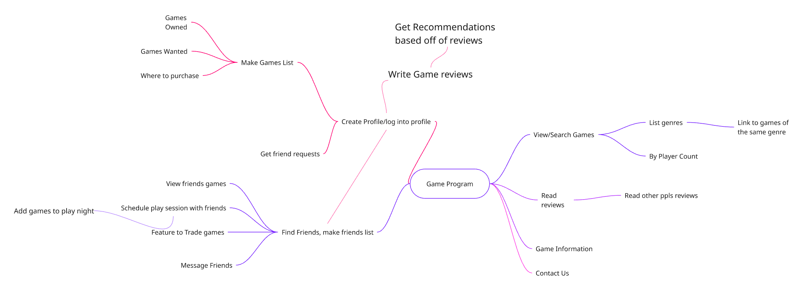
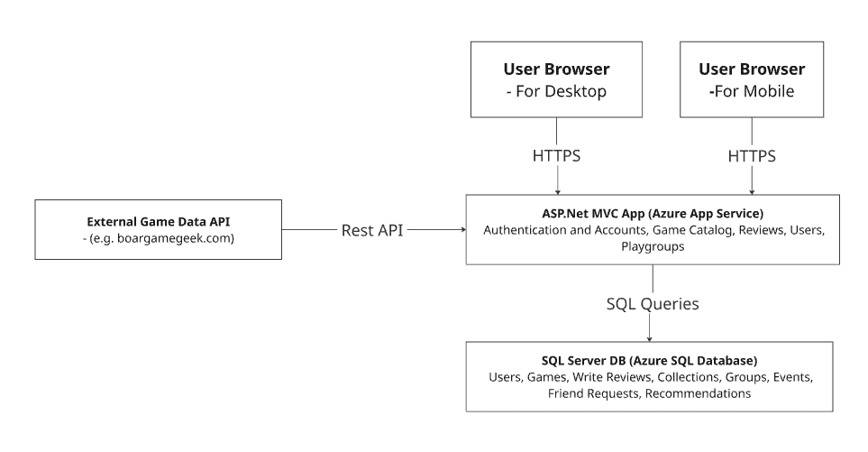

# Typing Heads - Senior Project

A senior software engineering class project repository for team "Typing Heads".

# Project Vision Statement

**BoredGamers** is a web-based platform designed for board game players to discover new games, track and manage personal collections, and coordinate gameplay with friends in one centralized space. By making it easy to see what games friends own, decide what to play, and arrange when to play, BoredGamers reduces the friction and indecision that often prevent groups from actually getting games to the table. Unlike existing platforms that focus primarily on reviews or cataloging, BoredGamers emphasizes social planning and shared decision-making. It is well-suited as a two-term project because it combines core technical components—such as authentication, data modeling, and recommendation logic—with room for iterative feature expansion.

Ideas explored can be viewed in this [Mindmap](https://miro.com/app/board/uXjVGP3PlUs=/)

## Team Members

* Logan Montgomery
* Adler Ceboll
* Ian Cooper

## Repository Structure

📁 [**documents/**](./documents/)

* 📁 [**resumes/**](./documents/resumes/) - Team member resumes

  * 📄 [Adler Ceboll's Resume](./documents/resumes/Adler_Ceboll_Resume.pdf)
  * 📄 [Ian Cooper's Resume](./documents/resumes/Ian_Cooper_Resume.pdf)
  * 📄 [Logan Montgomery's Resume](./documents/resumes/Logan_Montgomery_Resume.pdf)
  
* 📄 [Features and Needs](./documents/Features%20and%20Needs.md) - Feature requirements
* 📄 [Winter Term Schedule](./documents/schedule-winter-term.html) - Winter term schedule
* 🖼️ [Logo](./documents/logo.png) - Team logo
* 🖼️ [Letterhead](./documents/letterhead.png) - Team letterhead
* 🖼️ [Business Card](./documents/business-card.png) - Team business card design
* 📄 [Requirements](./documents/requirements.md)
* 📄 [Stakeholders and Personas](./documents/stakeholders-and-personas.md)

## Architecture

[Visual Diagram](https://miro.com/app/board/uXjVGO1p6sY=/)

## Getting Started

*Project implementation coming soon - currently in planning phase.*

