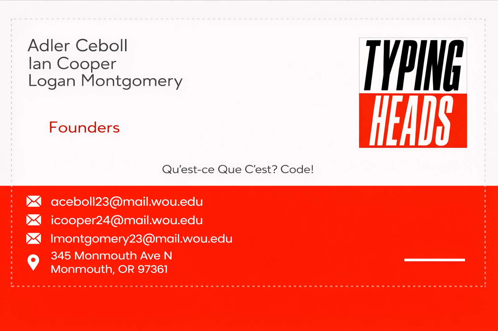
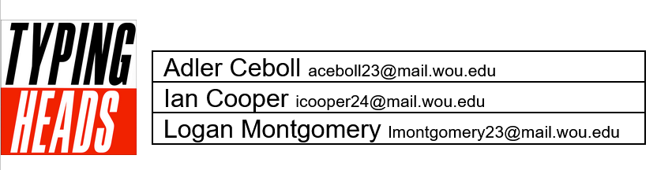

# Typing Heads - Senior Project

A senior software engineering class project repository for team "Typing Heads".

# Project Vision Statement

**BoredGamers** is a web-based platform designed for board game players to discover new games, track and manage personal collections, and coordinate gameplay with friends in one centralized space. By making it easy to see what games friends own, decide what to play, and arrange when to play, BoredGamers reduces the friction and indecision that often prevent groups from actually getting games to the table. Unlike existing platforms that focus primarily on reviews or cataloging, BoredGamers emphasizes social planning and shared decision-making. It is well-suited as a two-term project because it combines core technical components - such as authentication, data modeling, and recommendation logic—with room for iterative feature expansion.

## Team Members

* Logan Montgomery
* Adler Ceboll
* Ian Cooper

## Architectural Decisions

* Camel Case will be used for our naming convetions
* Test projects will end in the word _Tests
* ASP.NET core 9 identity
* Bootstrap will be our front-end CSS library
* jQuery 4 will be used
* Branches will be start with the sprint with a short description of the feature (e.g., s1-search-bar)
* Camel Case will also be used for db scripts, table names, and PK/FK names
* Eager loading will be used NOT lazy loading
* SQL will be used to build tables
* src contains all production code, tests contains all .NET test projects with BDD being separated from unit tests and frontend code and jest tests are separate from tests (repo structure contains this basic layout)

## Repository Structure

📁 [**src/**](./src/)

  📁 [**BoredGamers/**](./src/BoredGamers/)

📁 [**tests/**](./tests/)

  📁 [**BoredGamers.Tests/**](./src/BoredGamers.Tests/)

  📁 [**BoredGamers.BDD.Tests/**](./src/BoredGamers.BDD.Tests/)

📁 [**jestTests/**](./jestTests/)

  📁 [**BoredGamersJestTests/**](./src/BoredGamersJestTests/)

📁 [**documents/**](./documents/)

* 📁 [**resumes/**](./documents/resumes/) - Team member resumes

  * 📄 [Adler Ceboll's Resume](./documents/resumes/Adler_Ceboll_Resume.pdf)
  * 📄 [Ian Cooper's Resume](./documents/resumes/Ian_Cooper_Resume.pdf)
  * 📄 [Logan Montgomery's Resume](./documents/resumes/Logan_Montgomery_Resume.pdf)
  
* 📄 [Winter Term Schedule](./documents/schedule-winter-term.html) - Winter term schedule
* 🖼️ [Logo](./documents/logo.png) - Team logo
* 🖼️ [Letterhead](./documents/letterhead.png) - Team letterhead
* 🖼️ [Business Card](./documents/business-card.png) - Team business card design

## Architecture

[Visual Diagram](https://miro.com/app/board/uXjVGO1p6sY=/)

[Architecture Diagram](./documents/images/architecture-diagram.png)

## Getting Started

*Project implementation coming soon - currently in planning phase.*

# Other Info

Ideas explored can be viewed in this [Mindmap](https://miro.com/app/board/uXjVGP3PlUs=/)

[Stakeholders and Personas](./documents/stakeholders-and-personas.md)

[Timeline and Release plan](./documents/schedule.html)

[Features and Needs](./documents/features-and-needs.md) 

[Requirements](./documents/requirements.md)

[Modeling outputs](./documents/website-model.md)

[Jira set up and Epics entered](https://mail-team-lr2a75un.atlassian.net/jira/software/projects/TYP/boards/2/)

[DDL](./documents/DDL.md) and [Initial Data Model](./documents/images/DataModel.png)