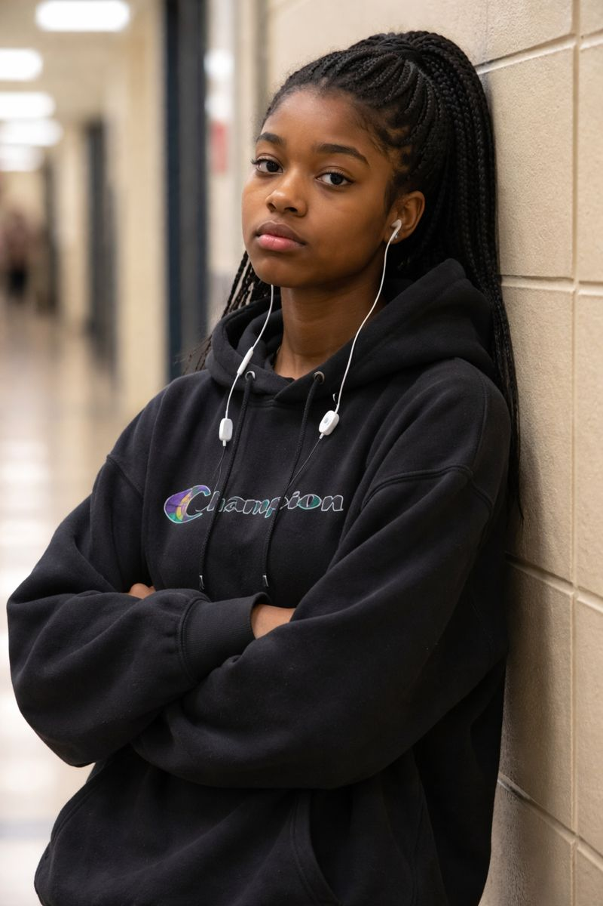
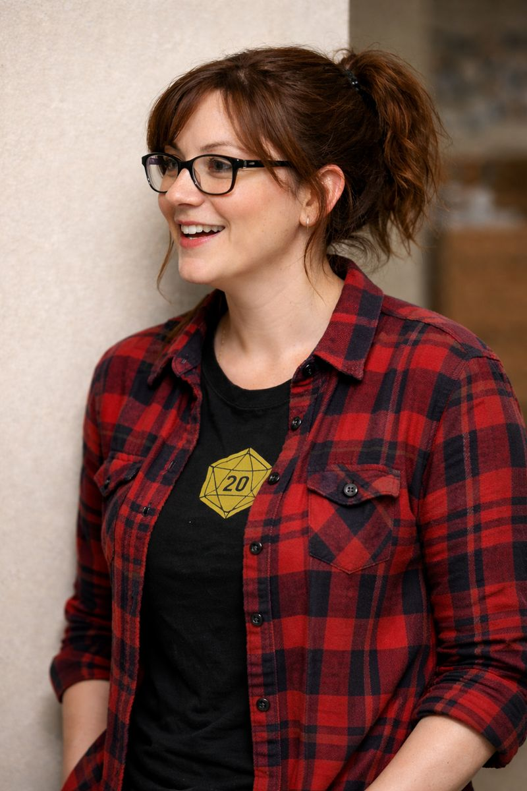
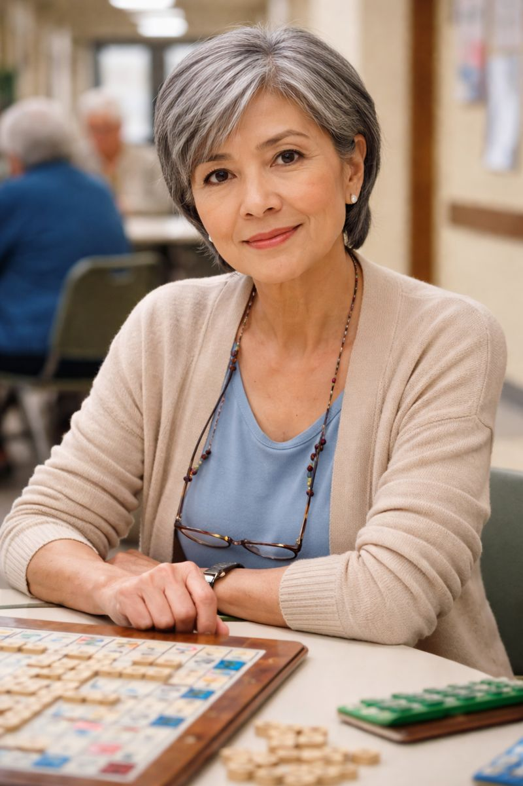

# Stakeholders and Personas

## Stakeholders

### Internal Stakeholders

**Adler Ceboll** - Developer / Repository Maintainer
- Role: Team member, likely maintains the upstream dev branch and handles pull requests
- Interest: Creating a useful product, learning full-stack development, completing senior project

**Logan Montgomery** - Developer
- Role: Team member, builds and maintains the application
- Interest: Creating a useful product, learning To train and integrate AI tools in genuinely useful and inventive ways, completing senior project

**Ian Cooper** - Developer
- Role: Team member, builds and maintains the application
- Interest: Creating a useful product, learning full-stack development, completing senior project

**Becka Morgan** - Instructor
- Role: Professor teaching the senior project course
- Interest: Ensuring project meets educational standards, student success
- Influence: High - sets milestone requirements and course expectations

**Chris Brooks** - Project Advisor
- Role: Adjunct professor advising the team, grading work
- Interest: Guiding students with industry-relevant practices, project quality
- Influence: High - provides weekly feedback, evaluates sprint deliverables

### External Stakeholders

**End Users (Board Game Enthusiasts)**
- Role: Primary consumers of the application
- Interest: Tracking collections, coordinating game nights, discovering games
- Influence: High - their needs drive feature development

**BoardGameGeek**
- Role: Existing platform, potential data source via API
- Interest: May view as competition or potential integration partner
- Influence: Medium - API access could accelerate development

**Online Game Retailers (Amazon, local shops)**
- Role: Potential affiliate partners for purchase links (stretch goal)
- Interest: Driving sales through referral traffic
- Influence: Low - future/stretch feature

---

## User Personas

### Persona 1: Jasmine Smith

| Attribute | Details |
|-----------|---------|
| **Age** | 17 (Born 2008) |
| **Location** | 108 Kirkwood Way NW, Edmonton, AB, Canada |
| **Occupation** | High school student |
| **Family** | Lives with parents |

**Background:**
Jasmine reluctantly went on the website because her friend uses it regularly and wants Jasmine to play more board games with her and their group of friends. Jasmine thinks the website is "dumb" and is only creating an account because her friend begged her to.

**Tech Comfort:** High. Digital native, lives on phone and games online, but has little patience for apps that don't immediately prove their value.

**Goals:**
- See what games her friend group wants to play
- Coordinate when/where to meet up for game nights
- Maybe find a game that actually interests her

**Pain Points:**
- Doesn't see the point of "yet another app"
- Low motivation to invest time learning the platform
- Needs immediate value or will abandon it

**Quote:** *"If this takes more than 2 minutes to figure out, I'm out."*

---

### Persona 2: Amanda Murphy

| Attribute | Details |
|-----------|---------|
| **Age** | 31 (Born 1994) |
| **Location** | 1533 Stagecoach Rd, Grand Island, NE 68801 |
| **Occupation** | Unknown (likely professional, hosts regular game sessions) |
| **Family** | Has established friend group for tabletop gaming |

**Background:**
Amanda usually hosts for Dungeons and Dragons, but now she is looking for other pen and paper games to host and play with her friends to take a break from DnD. One of her friends recommending a game unintentionally gave her a link to our website.

**Tech Comfort:** Moderate-high. Comfortable with apps and online tools for organizing her D&D sessions.

**Goals:**
- Discover new tabletop/pen-and-paper games beyond D&D
- Read reviews to find games that fit her group's style
- Possibly track what games her group has tried

**Pain Points:**
- Overwhelmed by the sheer number of tabletop options out there
- Hard to know if a game will work for her specific group dynamic
- Needs recommendations tailored to RPG/storytelling players

**Quote:** *"We love D&D, but sometimes you need a palate cleanser."*

---

### Persona 3: Donavan Ferguson

| Attribute | Details |
|-----------|---------|
| **Age** | 44 (Born 1981) |
| **Location** | 1415 Lehman Ct, Pullman, WA 99163 |
| **Occupation** | Unknown (parent, returning hobbyist) |
| **Family** | Has kids ages 8 and 12 |

**Background:**
Donavan used to be an avid board game player as a teenager and young adult, but his interest declined in his mid 20s. Now he is getting back into them with his kids who are 8 and 12. Looking online for old games he used to play as a kid, he stumbled upon our website. After scrolling through the website he gets pretty excited to use it as he can search for all the old games he used to play.

**Tech Comfort:** Moderate. Uses technology for work and daily life, comfortable enough but not seeking complexity.

**Goals:**
- Find classic games from his childhood (nostalgia)
- Discover age-appropriate games for his 8 and 12 year old
- Build a collection to share gaming with his kids
- Maybe connect with other parents doing the same

**Pain Points:**
- Out of touch with modern board game scene—feels overwhelming
- Needs to filter by age appropriateness
- Limited time as a parent; needs quick, reliable recommendations

**Quote:** *"I want my kids to know what real gaming was like before everything went digital."*

---

### Persona 4: Gloria Chen

| Attribute | Details |
|-----------|---------|
| **Age** | 65 (Born 1960) |
| **Location** | 742 Maple Ridge Dr, Boise, ID 83702 |
| **Occupation** | Retired elementary school librarian |
| **Family** | Widowed, two adult children, four grandchildren |

**Background:**
Gloria has played card games and classic board games her whole life—bridge club, Scrabble with her late husband, Candy Land with the grandkids. When her retirement community started a weekly "modern board game night" run by a younger resident, she discovered there's a whole world beyond Monopoly. Now she's hooked on games like Azul, Splendor, and Cascadia. She found the website searching for "board games for seniors" and was pleasantly surprised it wasn't condescending.

**Tech Comfort:** Low-moderate. Has a tablet and smartphone, video calls with grandkids, uses Facebook. Frustrated by small text, cluttered interfaces, and anything that assumes she knows what an "OAuth" is.

**Goals:**
- Keep a list of games she's tried and which ones she liked
- Find games that work well for her group (4-6 players, not too complex, no tiny pieces)
- Read reviews from people her age, not just 20-somethings
- Maybe gift recommendations for grandkids

**Pain Points:**
- Most gaming sites feel like they're designed for a younger crowd
- Needs larger text and clear navigation
- Doesn't want to create "yet another account" but will if the value is clear
- Complexity ratings don't tell her if arthritis-friendly or readable cards

**Quote:** *"I didn't survive 30 years of kids asking 'where's the bathroom' to be defeated by a website."*

---

## Persona Summary Matrix

| Aspect | Jasmine | Amanda | Donavan | Gloria |
|--------|---------|--------|---------|--------|
| **Age** | 17 | 31 | 44 | 65 |
| **Primary Use** | Peer pressure / social | Discovery / hosting | Nostalgia / family | Social / retirement |
| **Tech Savvy** | High (but impatient) | Moderate-High | Moderate | Low-Moderate |
| **Motivation Level** | Low (reluctant) | Medium (curious) | High (excited) | Medium-High (new hobby) |
| **Collection Size** | None/minimal | Unknown | Rebuilding | Small but growing |
| **Key Need** | Immediate value | Recommendations | Search + age filters | Accessibility + simplicity |

---

## Notes

- Personas represent different entry points: reluctant teen, curious hobbyist expanding interests, returning player with family, retiree discovering new hobby
- Geographic diversity: Canada, Nebraska, Washington, Idaho
- Age diversity: 17, 31, 44, 65
